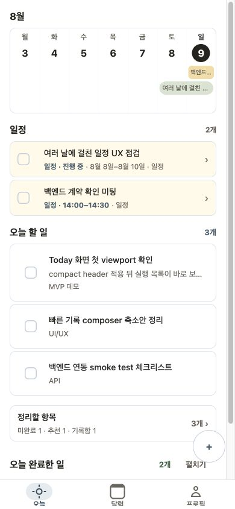
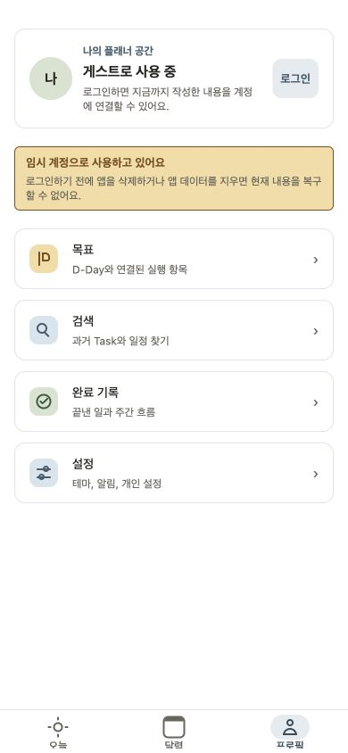

# 최초 사용 흐름 UX audit — 2026-08-09

## Audit scope

신규 설치 사용자의 첫 진입부터 게스트 상태 확인, 로그인 연결, 게스트 생성 실패까지를 Web 390×844 viewport에서 확인했다. mock 성공 상태와 real API 연결 실패 상태를 함께 사용했다.

## User goal

로그인을 강요받거나 인증 오류를 보지 않고 첫 Task를 만들고, 나중에 데이터가 계정으로 연결된다는 사실을 이해한다.

## 확인 화면

### 1. 최초 실행 성공 — 개선 필요

별도 안내 없이 샘플 데이터가 많은 Today로 진입한다. 앱의 핵심 화면은 즉시 보이지만, 실제 사용자 데이터와 예시를 구분하기 어렵고 게스트 계정·데이터 보존 방식을 알 수 없다.

### 2. 게스트 Profile — 양호하지만 늦음

계정 연결 가능성과 앱 데이터 삭제 시 복구 제한은 명확하다. 다만 사용자가 Profile을 열기 전에는 이 정보를 접할 수 없다.

### 3. 로그인 연결 — 양호

일정·할 일·완료 기록 동기화의 이점을 설명하고 계정 만들기로 이어진다. 병합 실패 시 게스트로 안전하게 돌아가는 UI는 백엔드 계약 이후 추가 검증이 필요하다.

### 4. 게스트 생성 실패 — 안전하지만 막힘

Today의 여러 영역에 인증 오류를 노출하지 않고 시작 단계에서 차단한다는 점은 안전하다. `다시 시도` 외에 로그인 우회가 없고 오류 이유도 게스트 생성과 저장 계정 확인을 한 문장에 섞어 사용자가 복구 방법을 판단하기 어렵다.

## Strengths

- 인증 bootstrap 완료 전 데이터 화면과 query를 막는다.
- 게스트 token 발급·확인 실패를 Today의 부분 오류가 아니라 하나의 시작 상태로 처리한다.
- Profile에 계정 연결 가치와 복구 제한을 함께 설명한다.
- 로그인 화면의 목적과 회원가입 진입이 분명하다.

## Notable risks

1. 게스트 계정이 사용자 동의나 설명 없이 생성된다.
2. 첫 Today의 샘플 데이터가 사용자의 실제 항목처럼 보이며 첫 행동을 방해한다.
3. 온보딩, 기능 둘러보기, 도움말 다시 보기가 없다.
4. 첫 시작에 네트워크와 게스트 API가 필수인데 실패 시 로그인 우회가 없다.
5. 순수 로컬 저장이 아닌데 `로컬로 시작`으로 표현하면 복구와 네트워크 기대를 잘못 만들 수 있다.
6. D-Day, 정리할 항목, 반복 일정처럼 차별 기능은 발견을 사용자의 탐색에 의존한다.

## Recommendations

1. 첫 실행에서 한 화면으로 `로그인 없이 시작`과 `로그인 또는 계정 만들기`를 선택하게 한다.
2. 게스트 생성은 선택 이후에 실행하고 실패 상태에서도 로그인 우회를 유지한다.
3. 신규 게스트는 빈 Today와 첫 Task 입력으로 시작하고, 완료 체크를 실제 행동으로 익히게 한다.
4. 기능 설명은 필수 슬라이드가 아니라 Today, Calendar, D-Day의 첫 방문에 맞춘 맥락형 도움말로 제공한다.
5. Settings에 가이드 다시 보기를 제공하고 온보딩 완료 상태를 버전과 tip id로 나눠 저장한다.
6. `FIRST_USE_FLOW.md`의 상태표를 인증·데이터 query의 단일 진입 기준으로 사용한다.

## Evidence limits and verification gaps

- Web responsive 화면을 기준으로 했으며 Android/iOS native safe area, 키보드, VoiceOver, TalkBack은 확인하지 않았다.
- real API 화면은 현재 로컬 백엔드의 게스트 발급 실패 상태다. 배포 환경의 endpoint와 병합 성공·실패는 별도 smoke가 필요하다.
- mock 샘플 데이터는 개발 확인용이므로 실제 신규 계정의 초기 데이터 정책을 real API에서 재확인해야 한다.
