# Dooit 전반 검토와 기능 보완 제안

검토 기간: 2026-09-13~14 · 최종 정리: 2026-09-14 · 코드 기준: `dce8d20`

## 결론과 범위

핵심 기록·계획·실행·체크리스트 기능은 갖춰졌다. 다음 단계는 날짜·복구·내비게이션의 일관성을 보완하고 최신 APK와 운영 API를 실제 기기에서 함께 검증하는 것이다. 기능이 있다는 사실과 실사용·출시 검증을 통과했다는 사실은 분리한다.

이번 작업은 문서 최신화와 검토다. 제안한 기능이나 화면 수정은 아직 구현하지 않았다. 과거 audit은 역사적 근거로만 참조하고 이번 시각 판정은 새로 촬영한 화면에 한정한다.

- 화면: Expo Web mock, Chrome 확장, light, 390×844. 13~14단계는 320×844.
- 브라우저: 이전 검증의 Chrome 연결을 재사용했다. 내장 브라우저는 `Browser is not available: iab` 이후 복구 지침·목록 확인에서 Chrome만 연결돼 전환한 상태였다. 이번 검토에서 브라우저를 새로 우회하거나 Playwright CLI를 사용하지 않았다.
- 01~05 캡처는 9월 13일, 06~14는 9월 14일이다. 날짜를 넘긴 중단·재개를 같은 날짜의 연속 거래로 해석하지 않는다.
- 코드 검토: 날짜 계산, query·mutation cache, API 재시도, 작성 상태, 권한, 알림, 배포 설정과 문서.
- 외부 읽기: 9월 13일 EAS build 조회, 운영 readiness·metadata·익명 OpenAPI. 사용자 데이터 mutation이나 백엔드 변경 없음.

## 확인된 배포 상태

| 대상            | 이번 확인                                        | 의미·남은 확인                                               |
| --------------- | ------------------------------------------------ | ------------------------------------------------------------ |
| Android preview | `23dcd244-9d8a-4be1-bd45-284ba0e8a531`, FINISHED | 완료 시각 2026-09-10 02:12:34 KST; 앱 1.0.0 / versionCode 1  |
| APK 코드        | `81995c5`                                        | `c133220` 완료 영역 조건 개선 미포함. 최신 코드 APK 필요     |
| API readiness   | UP                                               | 서버 응답 가능; 사용자 기능 통과를 의미하지 않음             |
| API metadata    | commitSha=local, imageTag=3bda00c                | 배포 식별 검사 통과. 실제 source SHA·migration 대응은 미확인 |
| 익명 OpenAPI    | HTTP 403                                         | 의도된 인증 정책일 수 있음. 승인된 확인 경로 필요            |
| CI              | `dce8d20` 성공은 이전 CI 복구에서 확인           | 캡처 날짜 의존 검사는 7일마다 재실행 결과가 달라짐           |

빌드 원본은 [EAS](https://expo.dev/accounts/hyunseung2/projects/dooit-mobile/builds/23dcd244-9d8a-4be1-bd45-284ba0e8a531)에서 확인한다. 설치·업데이트·알림·최신 production 데이터 smoke는 이번 감사에서 수행하지 않았다.

## 단계별 화면 감사

### 1. 빈 Today — 양호

첫 기록 CTA와 완료 0개 영역 숨김이 명확하다. 알림·서버 시작 검증은 제외했다.

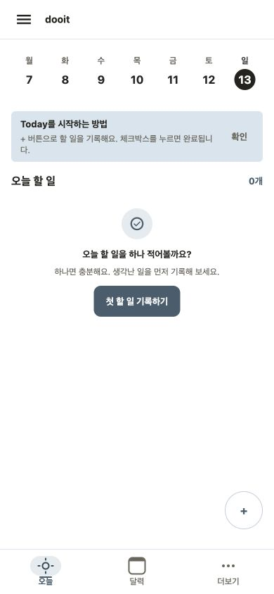

### 2. 빠른 기록 저장 — 양호

저장 위치·오늘 이동·상세 확인이 같은 맥락에 있다. mock 저장·오늘 이동 성공.

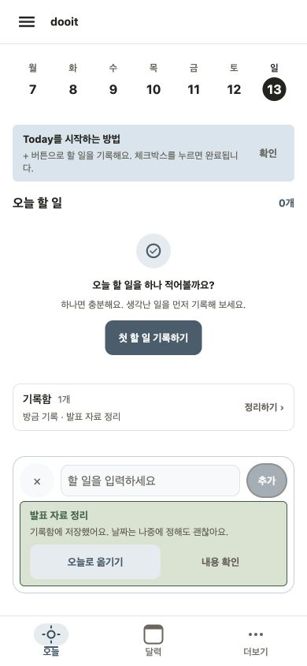

### 3. 카테고리 메뉴 — 보완

미분류 count가 있지만 비활성이다. 펼치면 검색·설정이 아래로 밀려 스크롤 발견성이 중요하다.

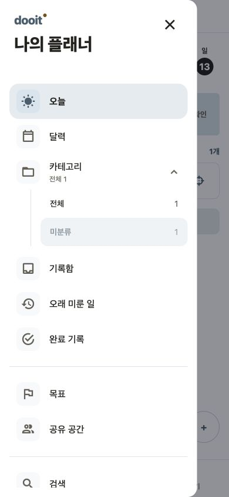

### 4. 한 가지 실행 — 양호

제목과 완료 행동이 분명하다. 타이머·집중 이력 기능은 현재 없다.

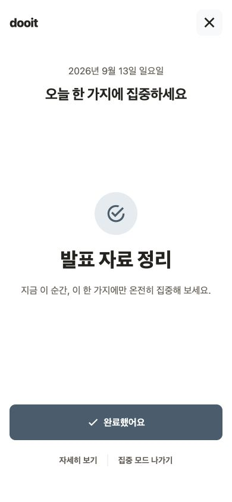

### 5. 오늘 계획 — 보완

확정 후 Today 이동은 성공했다. Today에서 순서를 바꿀 수 있다는 안내와 실제 조작이 불일치한다.

### 6. 하루 마감 — 제한적 확인

날짜가 넘어간 뒤 빈 마감 상태를 캡처했다. 앞 단계의 계획과 같은 날짜 결과 검증으로 취급하지 않는다.

### 7. 작성 중 초안 — 보완

제목 입력과 저장 활성화는 정상이다. 이 상태를 새로고침 복구의 기준으로 사용했다.

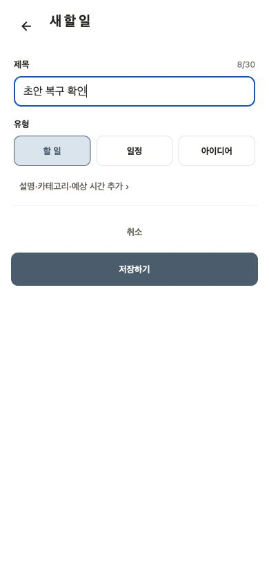

### 8. 작성 URL 직접 진입 후 뒤로 가기 — 문제 재현

뒤로 가기를 눌러도 작성 화면에 남고 GO_BACK was not handled 개발 경고가 나타났다.

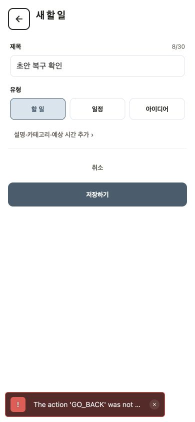

### 9. 새로고침 후 작성 화면 — 문제 재현

제목이 빈 값으로 초기화됐다. 아직 저장하지 않은 입력이 사라진다.

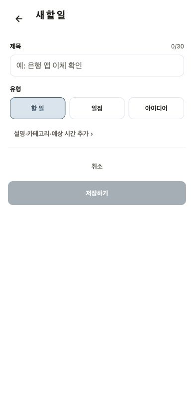

### 10. 개인 체크리스트 — 양호

항목 추가·완료 후 1/1과 모두 완료했어요가 반영됐다. Workspace 역할별 검증은 제외했다.

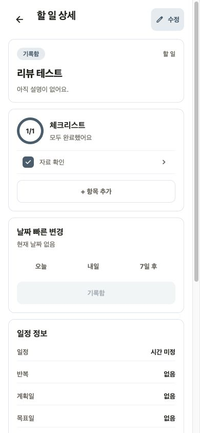

### 11. 공유 공간 게스트 제한 — 양호

계정 연결 필요 이유와 로그인 행동이 함께 보인다. 멤버 기능은 로그인 경계에서 검증을 멈췄다.

### 12. 로그인 진입 — 양호

이메일·비밀번호·재설정·게스트 계속 사용 진입이 보인다. 실제 계정 제출·메일 발송은 하지 않았다.

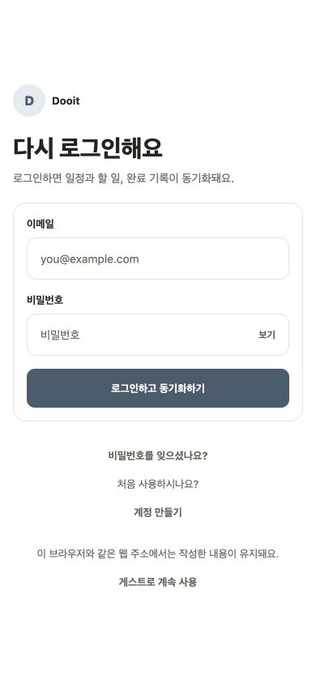

### 13. 320px 달력 — 양호·한계

7열과 날짜 선택이 폭 안에 들어온다. 일정이 없는 상태이며 많은 일정·큰 글꼴 검증은 별도다.

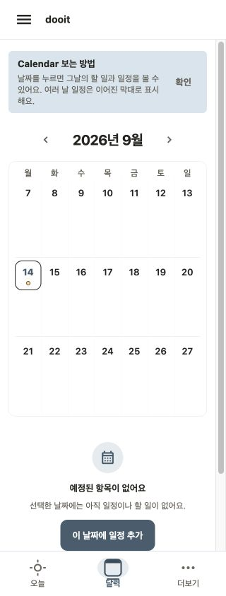

### 14. 320px 일정 작성 — 보완

줄바꿈은 유지되나 알림 radio의 DOM 높이가 38px로 내부 44 기준보다 작다. 실제 기기 hit area 재검증이 필요하다.

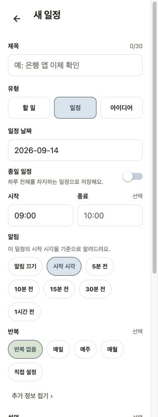

## 재현된 문제와 구현 공백

우선순위는 사용자 영향과 다음 내부 APK 사용을 기준으로 정했다. P0는 다음 검증 후보 전에 해결·재검증할 항목, P1은 다음 보완 묶음, P2는 사용 요구가 확인된 뒤의 확장이다.

| ID  | 우선순위·근거            | 발견                                                                                               | 권장 조치와 통과 기준                                                                                                                    |
| --- | ------------------------ | -------------------------------------------------------------------------------------------------- | ---------------------------------------------------------------------------------------------------------------------------------------- |
| R1  | P0 · DOM 관찰+코드       | 14일 재개 직후 Today DOM은 13일을 가리켰고 화면 이동 뒤 14일이 됨                                  | 서울 날짜를 공통 hook으로 관리하고 자정·앱 활성화·Web focus에 갱신. 23:59→00:01과 하루 뒤 복귀에서 표시·조회·mutation 날짜가 일치해야 함 |
| R2  | P0 · 화면 08             | 작성 URL 직접 진입 시 router.back이 처리되지 않음                                                  | history 유무에 따른 안전한 기본 목적지 적용. 직접 링크·새로고침·앱 내부 진입 모두 되돌아갈 수 있어야 함                                  |
| R3  | P1 · 화면 07~09+코드     | TaskForm 입력이 useState에만 있어 새로고침 시 소실                                                 | 로컬 초안과 복원/버리기 UX. 저장 성공 후 제거, 계정·Workspace 격리, 로그아웃 정리, 만료를 함께 설계                                      |
| R4  | P1 · 화면 05+코드        | 순서 변경 안내가 있지만 Today UI에 변경 action 없음                                                | 우선 안내를 실제 동작에 맞추고 focus 선택·순서 UI 설계. reorderToday API는 이미 있으므로 신규 서버 기능으로 재요청하지 않음              |
| R5  | P1 · 코드+진입 관찰      | Inbox·미룬 항목이 없으면 일반 오늘 계획 진입이 사라지고, 실행 Task가 0이면 하루 마감 진입도 사라짐 | 계획 확정·결과 확인 진입을 데이터 유무와 분리. 모두 완료한 날에도 결과를 열 수 있어야 함. 완료 영역 숨김 요구는 유지                     |
| R6  | P1 · 화면 14·DOM 측정    | 일정 알림·반복 chip 높이 38, 추가 정보 토글 코드 최소 높이 32                                      | 내부 44×44 기준 충족. 320폭 줄바꿈과 native 터치 영역·스크린리더를 함께 확인                                                             |
| R7  | P1 · 화면 03·명시된 제한 | 미분류 항목은 count만 표시하며 목록을 열 수 없음                                                   | null-category 검색 계약과 cursor pagination을 먼저 정의. 0개·여러 페이지·카테고리 변경 후 이동 검증                                      |

코드 근거:

- R1: [Today 날짜 계산](<../../../src/app/(tabs)/index.tsx>), [query focus 처리](../../../src/providers/query-provider.tsx). query 재조회만으로 부모 화면의 날짜 상태 변경을 보장할 수 없다. 타이머 기반 자동 회귀는 아직 없다.
- R2~R3: [새 Task](../../../src/app/tasks/new.tsx), [TaskForm](../../../src/features/tasks/task-form.tsx), [빠른 기록](../../../src/features/today/quick-capture.tsx). 빠른 기록은 닫기만으로 제목을 지우지는 않지만 프로세스·페이지 재시작 초안 저장은 없다.
- R4~R5: [오늘 계획](../../../src/features/today/today-review-screen.tsx), [Today 목록](../../../src/features/today/today-task-list.tsx), [Today 영역 조건](../../../src/features/today/today-overview.tsx). 현재 focus는 서버 값 또는 Today 앞 최대 3개로 계산하며 사용자가 직접 선택하는 UI는 없다.

## 코드상 위험 — 실환경 재현 전

| ID  | 위험                                             | 근거와 확인 방법                                                                                                                                                                       |
| --- | ------------------------------------------------ | -------------------------------------------------------------------------------------------------------------------------------------------------------------------------------------- |
| C1  | 완료·재개 뒤 다른 화면에 이전 상태가 남을 가능성 | useCompleteTask/useReopenTask는 today·done 일부 cache만 갱신한다. Task 상세·검색·Calendar query를 먼저 연 뒤 완료/재개하고 staleTime 30초 내 재진입하여 확인. 공통 cache 정책으로 보완 |
| C2  | refresh 실패 시 기존 내용이 사라질 가능성        | TodayOverview는 error이면 전체 notice를 반환한다. 캐시가 있는 상태의 background refetch 실패에서 목록 유지·재시도를 검증                                                               |
| C3  | native 네트워크 복귀 자동 갱신 연결 부족         | QueryProvider에 AppState focus 연결은 있으나 onlineManager 연결은 없다. foreground에서 Wi-Fi 차단→복원 시 재조회 여부 확인                                                             |
| C4  | 수동 재시도 중복 생성 가능성                     | API client의 자동 timeout 재시도는 같은 idempotency key지만 사용자가 다시 누른 mutation은 새 request/key다. 서버 저장 후 응답 2회 유실→수동 재시도 상황에서 하나만 생성되는지 확인     |
| C5  | 알림 시간·문구 불일치 가능성                     | task-notification-delivery는 종일 알림에 device-local setHours(9)를 사용하고 사전 알림도 시작 시각 문구를 사용한다. 서울 계약·다른 기기 시간대·5/30분 전을 검증                        |
| C6  | 서버 CLOSED 상태와 화면 마감 완료 의미 불명확    | 화면은 Task 이동과 summary 조회를 제공하지만 CLOSED 저장 호출은 없다. 마감을 단순 정리로 정의할지 서버 종료 상태로 정의할지 API 계약에서 결정                                          |

[React Query 공식 native 가이드](https://tanstack.com/query/latest/docs/framework/react/react-native)는 앱 focus 처리와 onlineManager 연결을 별도로 설명한다. C3는 이 가이드와 현재 코드의 차이에 근거한 검증 제안이며, 실제 기기 장애 재현 결과는 아니다.

## 신규 기능 후보

| 순서       | 후보                           | 사용자 가치·최소 범위                    | 의존성·결정 기준                                                                |
| ---------- | ------------------------------ | ---------------------------------------- | ------------------------------------------------------------------------------- |
| 1          | 초안 복구                      | 작성하던 제목·설명·시간을 재시작 뒤 복원 | 프론트 로컬 저장, 계정 격리 필수. R3 해결 범위                                  |
| 2          | 완료·날짜 이동 실행 취소       | 실수 직후 원상 복구                      | 단일 action부터. 원래 날짜·상태 복원과 반복 Task·권한 변경·실패 처리 필요       |
| 3          | focus 선택·순서 변경           | 오늘 먼저 할 일을 사용자가 선택          | 기존 Daily Plan/reorder 계약 재사용 가능성 검토; R4와 함께 3안 비교             |
| 4          | 미분류 탐색·기존 카테고리 제안 | 기록 분류·검색의 끊김 해소               | 미분류 서버 필터 필요. 입력 자동완성은 summary 재사용, CRUD 확대와 분리         |
| 5          | Android 공유 메뉴 빠른 기록    | 다른 앱에서 본 링크·텍스트를 즉시 기록   | 기존 prototype 활용. 별도 native build·인증·cold start 검증                     |
| 6          | 개인 데이터 내보내기           | 장기 사용 데이터의 보관·이동             | 게스트/계정 범위·파일 형식·민감정보·대량 pagination을 계약화                    |
| Store 준비 | 계정 삭제                      | 계정 종료 경로 제공                      | 현재 모바일 UI/계약에서 찾지 못함. backend 삭제·Workspace 소유권·세션 폐기 필요 |

App Store에 계정 생성 앱을 제출할 때는 앱에서 계정 삭제를 시작할 수 있어야 한다. 현재 내부 Android APK 범위의 새 의무로 취급하지 않고 iOS 공개 준비 항목으로 관리한다. [Apple 공식 안내](https://developer.apple.com/support/offering-account-deletion-in-your-app)

습관·Pomodoro·AI 일정 재배치·Kanban·주간 점수는 현재 실행 루프가 안정화되고 실제 사용 요구가 확인될 때 재검토한다. 기능 제안은 출시 범위 승인이나 구현 완료를 의미하지 않는다.

## 검증 계획과 제한

1. 날짜 전환·뒤로 가기·cache 일관성의 재현 회귀를 먼저 추가한다.
2. 초안과 focus 선택·마감 결과 진입은 기존 Product Design 정책에 따라 시각안 선택 후 구현한다.
3. 최신 코드를 새 preview로 빌드하고 versionCode·서명 연속성을 확인한다.
4. 운영 imageTag·실제 SHA·migration을 대응시킨 뒤 게스트/등록 계정·Workspace 역할별 real smoke를 한다.
5. Android 실기기에서 하루 사용, 알림·재부팅·offline 복귀·큰 글꼴·dark·TalkBack을 확인한다.

이번 검토는 모든 화면의 모든 상태에 대한 인증이 아니다. Workspace OWNER/EDITOR/VIEWER, 초대 발송, 실제 이메일·계정 병합·세션 만료, 반복 occurrence 편집·삭제, 대량 데이터 성능, D-Day end-to-end, native widget·공유 메뉴·알림 전달은 이번에 재실행하지 않았다. 기존 단위 테스트와 과거 audit은 이 공백을 대체하지 않는다.

접근성은 보이는 배치, 접근성 이름으로 수행한 조작과 한 radio의 DOM 크기까지 확인했다. 전체 keyboard 순서·스크린리더·큰 글꼴·native hit area 준수 판정은 보류한다. console에는 직접 경로 GO_BACK 경고가 관찰됐다.

## 최종 검증

2026-09-14 `npm run validate` 통과: TypeScript·lint·format·문서 링크·대표 캡처 유효기간·release 정적 검사·97 suites / 491 tests. 이후 검증 결과 기록에 대해서 문서 링크와 형식을 다시 확인했다. 앱 코드는 이번 검토에서 변경하지 않았고, 문서와 audit 캡처만 작업 트리에 남겼다.
