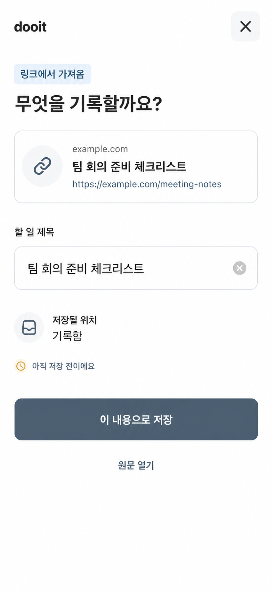

# 공유 메뉴 빠른 기록 화면 검토

Last updated: 2026-09-02

## 범위

- 다른 앱에서 공유한 단일 텍스트 또는 URL 확인
- 제목 편집
- 저장 전 상태와 기록함 목적지 확인
- 기존 Task 생성 API로 기록함 저장
- 원문 링크 열기와 취소

## 선택한 방향

3안의 링크 맥락 중심 구조를 선택하고 다음을 다듬었다.

- 큰 저장 전 안내 panel을 작은 inline 상태로 축소
- 상단 닫기와 중복되는 하단 취소 제거
- `원문 열기`를 primary action 아래의 단일 보조 행동으로 정리
- 텍스트만 공유되면 링크 preview가 사라지는 구조 적용

## 구현 경계

- `expo-sharing` 수신 기능은 공식 문서상 experimental이다.
- 기본 production·preview app config에는 sharing extension을 넣지 않는다.
- `outside-capture` EAS build profile에서만 Android `text/plain` intent와 iOS text·URL Share Extension을 활성화한다.
- 사용자 확인 없이 자동 저장하지 않는다.
- 이미지·파일·다중 payload는 이번 범위에서 제외한다.

## 검증 상태

- `npm run validate`: 84 suites, 433 tests 통과
- 기본 app config: `expo-sharing` plugin 제외 확인
- `EXPO_PUBLIC_ENABLE_OUTSIDE_CAPTURE=true`: Android·iOS plugin과 iOS App Group/extension target 포함 확인
- 390 × 844 실제 브라우저 캡처와 선택 시안 비교: 통과
- 제목 편집·빈 제목 오류·원문 열기·저장·취소: 통과
- browser console error: 0
- Android·iOS development build의 실제 공유 메뉴 수신: 미검증

## 구현 근거

- [`01-review.png`](./01-review.png): 초기 공유 검토 화면
- [`02-validation.png`](./02-validation.png): 빈 제목 validation
- [`03-edited.png`](./03-edited.png): 제목 편집
- [`04-saved-task.png`](./04-saved-task.png): 기록함 저장 후 Task 상세
- [`comparison.png`](./comparison.png): 선택 시안과 최종 구현 나란히 비교

최종 시각 판정은 저장소 루트 [`design-qa.md`](../../../design-qa.md)를 따른다.
