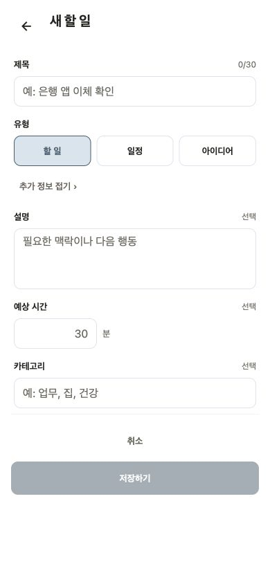
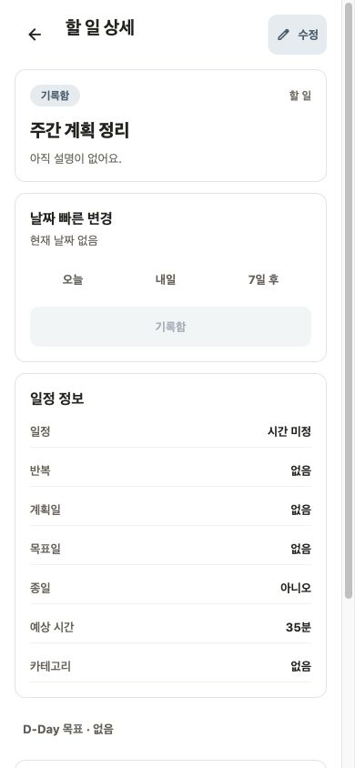
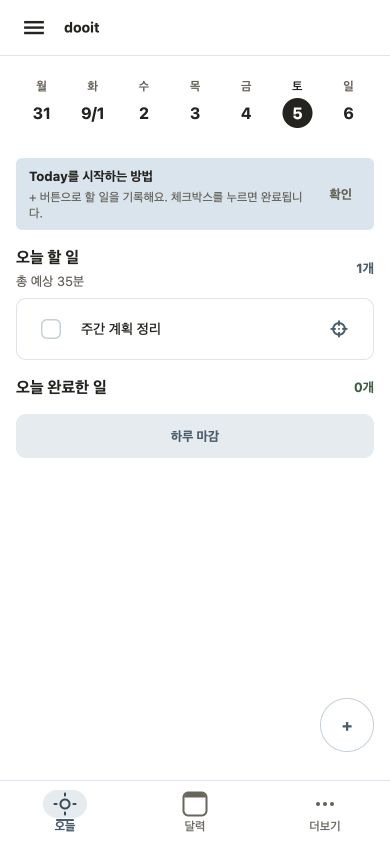
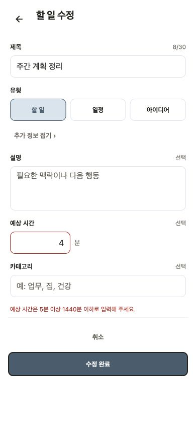

# Task 예상 시간 화면 감사

Last verified: 2026-09-05

## 범위와 선택

- 사용자 목표: Task에 예상 소요 시간을 선택적으로 기록하고 Today에서 실행 Task의 총 예상 시간을 빠르게 확인한다.
- 구현 기준: working tree, base `6f89153`
- 환경: Expo Web, mock API, Chrome, 390×844 viewport
- browser fallback: ChatGPT 앱 내장 브라우저가 제공되지 않아 연결 가능한 Chrome 확장으로 검증했다.

기존 Task form과 Today 정보 위계를 기준으로 다음 세 방향을 비교했다.

1. 추가 정보 안의 숫자 입력 + Today section 설명: 기존 패턴을 유지하고 기본 화면 밀도를 늘리지 않는다.
2. 15·30·60분 chip + 직접 입력: 빠르지만 작은 화면에서 control 수와 선택 상태가 과해진다.
3. Today card별 inline 입력: 계획 중 수정은 빠르지만 실행 목록의 핵심 행동인 완료·집중을 방해한다.

1안을 선택했다. 예상 시간은 일정 시작·종료와 독립된 선택 정보이며, 설정하지 않은 Task는 합계에서 제외한다.

## 단계별 결과

### 1. Task 입력 — 양호

- 설명과 카테고리 사이의 추가 정보로 배치되어 기본 생성 흐름을 방해하지 않는다.
- 숫자 입력, `분` 단위와 `선택` 표시가 함께 있어 값의 의미가 분명하다.
- 44px 이상 입력 높이와 접근성 label·hint를 유지했다.

### 2. Task 상세 — 양호

- 기존 일정 정보 행에 `35분`으로 표시되어 별도 card나 badge를 만들지 않는다.
- 일정 시작·종료와 다른 속성이라는 점이 같은 정보 묶음 안에서 유지된다.

### 3. Today 합계 — 양호

- `오늘 할 일` 바로 아래에 `총 예상 35분`을 표시해 Task 개수와 경쟁하지 않는다.
- 일정과 완료 Task는 제외하고 현재 실행 Task의 설정된 예상 시간만 합산한다.

### 4. 잘못된 입력과 복구 — 양호

- 백엔드 계약과 같은 5~1440분 범위를 안내한다.
- 오류가 있는 예상 시간 입력만 danger border로 강조하고 제목은 정상 상태를 유지한다.
- 값을 바꾸면 오류가 해제되며 저장을 다시 시도할 수 있다.

## 판정과 한계

- 치명적·높음 UX 문제나 390×844 레이아웃 잘림은 확인되지 않았다.
- console error는 없었다. 기존 React Native Web `shadow*` deprecation warning 1건은 이번 변경과 무관하다.
- Chrome DOM에서 label, button 상태와 읽기 순서는 확인했지만 VoiceOver·TalkBack, 실제 mobile keyboard, font scale 1.5와 native light·dark 화면은 확인하지 않았다.
- 예상 시간이 없는 Task 수를 별도로 경고하지 않는 현재 표현은 합계를 부담 없는 참고 정보로 유지하려는 의도다. 실제 사용에서 오해가 확인되면 `N개 미설정` 보조 문구를 검토한다.
