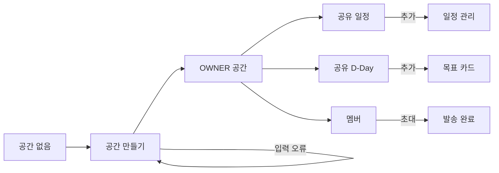

# UF-07 Workspace 흐름 audit

- 검증일: 2026-08-25
- 환경: Expo Web mock, Chrome, 390×844
- 계정: 등록 사용자 `demo@todolab.app`
- 범위: 공간 생성, OWNER 일정·D-Day 생성, 멤버 조회, 초대 발송

## 캡처와 판정

|   # | 상태                   | 판정      | 메모                                                                                                                                                   |
| --: | ---------------------- | --------- | ------------------------------------------------------------------------------------------------------------------------------------------------------ |
|  01 | Workspace 빈 목록      | 정상      | 첫 공간 생성 행동이 바로 보인다.                                                                                                                       |
|  02 | 공간 생성 기본값       | 정상      | 필수 이름과 선택 설명의 구분이 명확하다.                                                                                                               |
|  03 | 공간 이름 validation   | 정상      | 제출 위치에서 필수 입력 오류를 안내한다.                                                                                                               |
|  04 | 공간 생성 입력 완료    | 정상      | 저장 전 입력값을 확인할 수 있다.                                                                                                                       |
|  05 | 공간 생성 완료         | 정상      | 생성 직후 공간 카드와 OWNER 역할이 나타난다.                                                                                                           |
|  06 | 공유 일정 빈 상태      | 정상      | 빈 상태에서 일정 추가로 바로 이어진다.                                                                                                                 |
|  07 | 공유 일정 form         | 정상      | 제목·날짜·시간·반복 범위를 한 화면에서 입력한다.                                                                                                       |
|  08 | 공유 일정 생성 완료    | 해결됨    | 후속 [`Workspace Task 행동 위계 audit`](../workspace-task-actions-2026-08-26/README.md)에서 화살표·`상세 보기`를 제거하고 보조 행동을 메뉴로 정리했다. |
|  09 | 공유 D-Day 빈 상태     | 정상      | 목표 추가 행동이 명확하다.                                                                                                                             |
|  10 | 공유 D-Day form        | 정상      | 제목과 목표일을 간결하게 입력한다.                                                                                                                     |
|  11 | 공유 D-Day 생성 완료   | 정상      | 남은 날짜와 목표일을 즉시 확인할 수 있다.                                                                                                              |
|  12 | 멤버 목록              | 정상      | 이름·이메일·OWNER 역할이 함께 표시된다.                                                                                                                |
|  13 | 멤버 초대 form         | 정상      | 이메일과 역할을 함께 정할 수 있다.                                                                                                                     |
|  14 | 초대 이메일 validation | 정상      | 빈 이메일 제출을 막고 오류를 인접 표시한다.                                                                                                            |
|  15 | 초대 발송 완료         | 보강 필요 | 성공 안내는 분명하지만 대기 중인 초대를 다시 확인하거나 취소할 목록은 없다.                                                                            |

## 확인한 흐름

## 남은 검증

- 공간 수정·삭제의 성공, 입력 오류, 서버 오류
- 반복 일정 수정·삭제 범위와 D-Day 연결·해제
- 멤버 역할 변경·제거, 대기 중인 초대 조회·취소
- 초대 수락·거절과 만료·404·409 복구
- OWNER·EDITOR·VIEWER별 노출 및 차단 행동
- 게스트 접근 제한, 320·430 너비, 모바일 키보드·safe area, 스크린 리더
- 실제 백엔드에서 Task가 있는 Workspace 삭제 500 수정 후 회귀 검증

## 관련 근거

- [Workspace UI 기준 흐름](../../product/WORKSPACE_UI_FLOW.md)
- [초대 수락 audit](../workspace-invitation-2026-08-18/README.md)
- [탭 이동 audit](../workspace-navigation-2026-08-18/README.md)
- [반응형·키보드 audit](../workspace-responsive-2026-08-19/README.md)
- [접근 오류 audit](../workspace-access-error-2026-08-19/README.md)
