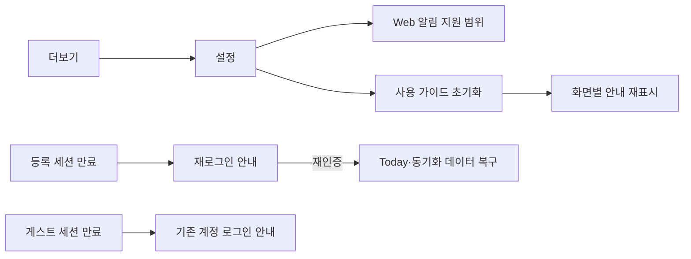

# UF-08 설정·알림·세션 복구 audit

- 검증일: 2026-08-26
- 환경: Expo Web mock, Chrome, 390×844
- 계정: 등록 사용자 `demo@dooit.app`
- 범위: 더보기, Web 설정, 사용 가이드 초기화, 등록·게스트 세션 만료, 재로그인

## 캡처와 판정

|   # | 상태                    | 판정      | 메모                                                                                                                           |
| --: | ----------------------- | --------- | ------------------------------------------------------------------------------------------------------------------------------ |
|  01 | 더보기                  | 보강 필요 | 설정 설명이 `테마, 알림, 개인 설정`이지만 실제 화면에는 테마 선택이 없다. 이번 변경에서 설명을 실제 기능에 맞춘다.             |
|  02 | Web 설정                | 정상      | 개발 환경 정보, Web 알림 지원 범위, 사용 가이드 행동을 한 화면에서 확인할 수 있다.                                             |
|  03 | 사용 가이드 초기화 성공 | 정상      | 성공 결과와 다음 행동이 인접한 안내로 표시된다.                                                                                |
|  04 | 등록 계정 세션 만료     | 정상      | 만료 원인과 재로그인 행동이 로그인 form 안에 함께 나타난다.                                                                    |
|  05 | 게스트 세션 만료        | 정상      | 자동으로 새 게스트를 만들지 않았다는 점과 기존 계정 로그인을 안내한다.                                                         |
|  06 | 재로그인 완료           | 보강 필요 | 인증과 데이터 복구는 확인했지만 만료 전 route가 아니라 Today로 이동한다. 초기화한 사용 가이드 상태도 계정과 무관하게 유지된다. |

## 확인한 흐름

## 구현과 문서 대조

- 앱 테마는 `useColorScheme()`으로 운영체제 설정을 따른다. 사용자가 앱 안에서 light·dark를 직접 선택하는 기능은 없다.
- Web 알림은 `모바일 앱에서 사용 가능`으로 표시되므로 권한 요청·거부·기기 설정 복귀는 Android·iOS에서 검증해야 한다.
- 등록 계정과 게스트 만료 문구는 분리돼 있다.
- 세션 만료 시 query cache를 비우고 로그인으로 이동한다. 재로그인 후 원래 route를 복원하는 정보는 현재 전달하지 않는다.

## 남은 검증

- Android·iOS light·dark 시스템 전환과 앱 재실행
- 알림 미결정·허용·거부·기기 설정 복귀, 예약 동기화 성공·오류
- foreground·background·cold start 알림 선택과 Task 상세 이동
- 실제 401에 의한 등록·게스트 세션 만료
- 만료 전 route 복원 여부의 제품 결정과 구현
- 로그아웃 실패, 계정 전환, 앱 재실행 뒤 세션 복원
- 320·430 너비, 모바일 safe area, VoiceOver·TalkBack
