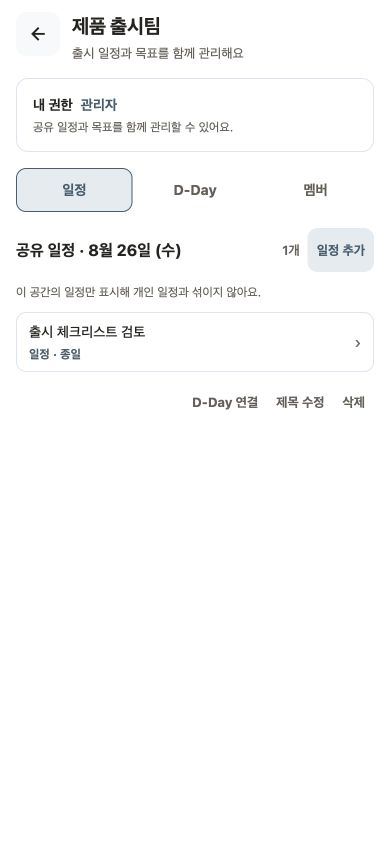

# Workspace Task 행동 위계 audit

- 검증일: 2026-08-26
- 환경: Expo Web mock, Chrome, 390×844
- 범위: OWNER가 공유 일정을 만든 뒤 사용하는 D-Day 연결·수정·삭제 행동

## 결론

D-Day 연결은 공유 일정과 목표를 잇는 주요 행동으로 유지하고, 빈도가 낮고 파괴적인 제목 수정·삭제는 `⋯` 메뉴로 묶었다. 상세 화면으로 이동하지 않는 카드에서는 화살표와 `상세 보기` 접근성 의미를 제거했다.

## 단계별 판정

| 단계 | 화면             | 상태                                     | 판정      |
| ---: | ---------------- | ---------------------------------------- | --------- |
|   01 | 기존 행동        | 버튼 3개와 이동 화살표가 동시에 노출됨   | 보강 필요 |
|   02 | 개선된 기본 상태 | D-Day 연결과 메뉴만 노출됨               | 정상      |
|   03 | overflow menu    | 제목 수정·삭제·닫기를 한 묶음으로 노출함 | 정상      |

| 01 기존 행동                           | 02 개선된 기본 상태                       | 03 overflow menu                         |
| -------------------------------------- | ----------------------------------------- | ---------------------------------------- |
|  |  |  |

## 확인한 강점

- 핵심 행동과 보조 행동의 위계가 분명해졌다.
- 삭제가 기본 화면에서 바로 노출되지 않아 실수 가능성이 줄었다.
- 메뉴 버튼은 일정 제목을 포함한 label과 메뉴의 목적을 설명하는 hint를 가진다.
- 이동하지 않는 카드가 더 이상 화살표나 `상세 보기`를 전달하지 않는다.

## 남은 검증

- 320px·430px, font scale 1.5, light·dark
- Android TalkBack·iOS VoiceOver에서 메뉴 열림과 focus 이동
- EDITOR에서 같은 행동, VIEWER에서 관리 행동 미노출
- D-Day 연결·해제, 제목 수정, 삭제 확인과 취소의 전체 상태
