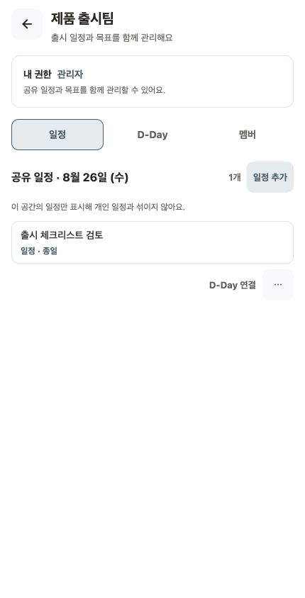
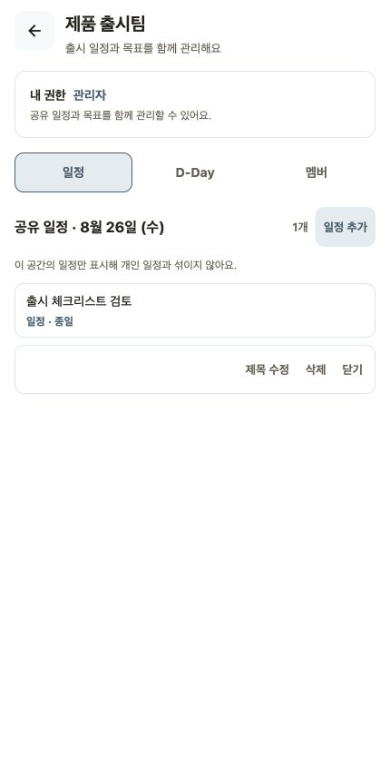

# Workspace Task 행동 반응형 검증

- 검증일: 2026-08-26
- 환경: Expo Web mock, Chrome
- 너비: 320px, 390px, 430px (`height: 844px`)
- 범위: Workspace 일정 카드의 D-Day 주요 행동과 overflow menu

## 결과

세 너비 모두 카드, `D-Day 연결`, 메뉴 버튼과 펼친 메뉴가 겹치거나 잘리지 않았다. 320px에서는 공간 안내가 한 줄 말줄임되지만 핵심 의미와 행동은 유지된다.

|  너비 | 기본 상태                          | 메뉴 상태                   | 판정 |
| ----: | ---------------------------------- | --------------------------- | ---- |
| 320px | 주요 행동과 메뉴 버튼이 한 줄 유지 | 수정·삭제·닫기가 한 줄 유지 | 정상 |
| 390px | 여백과 행동 위계 정상              | 메뉴 너비와 정렬 정상       | 정상 |
| 430px | 넓어진 카드와 행동 정렬 정상       | 메뉴 행동 정렬 정상         | 정상 |

| 01 320px 기본                       | 02 320px 메뉴                    |
| ----------------------------------- | -------------------------------- |
|  |  |

| 03 390px 기본                       | 04 390px 메뉴                    |
| ----------------------------------- | -------------------------------- |
|  |  |

| 05 430px 기본                       | 06 430px 메뉴                    |
| ----------------------------------- | -------------------------------- |
|  |  |

## 남은 검증

- font scale 1.5
- 시스템 light·dark
- iOS VoiceOver·Android TalkBack의 메뉴 열림과 focus 이동
- browser zoom 150%
