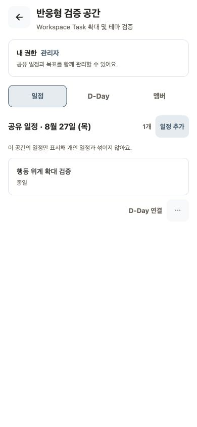
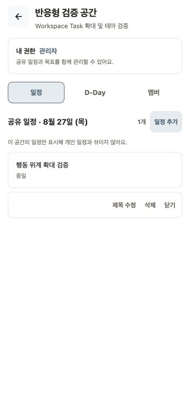

# Workspace Task 테마·접근성 중간 검증

- 검증일: 2026-08-27
- 환경: Expo Web mock, Chrome, 390×844, light
- 범위: Workspace Task의 D-Day 주요 행동과 overflow menu

## 결과

light 테마의 기본·메뉴 상태에서 카드와 행동이 겹치거나 잘리지 않았다. `D-Day 연결`, 일정 메뉴, `제목 수정`, `삭제`, `닫기`는 접근성 트리에서 각각 button으로 노출된다. 공통 `Button`과 `IconButton`은 최소 44px 터치 영역과 키보드 focus border를 제공한다.

| 단계 | 화면            | 판정 |
| ---: | --------------- | ---- |
|    1 | light 기본 상태 | 정상 |
|    2 | light 메뉴 상태 | 정상 |

| 01 light 기본                         | 02 light 메뉴                      |
| ------------------------------------- | ---------------------------------- |
|  |  |

## 접근성 위험

1. 일정 메뉴 버튼은 구체적인 label과 hint를 제공하지만 `IconButton`의 `expanded` 상태를 전달하지 않는다.
2. 메뉴가 열린 뒤 `제목 수정`으로 focus를 이동하거나 메뉴가 닫힌 뒤 trigger로 focus를 복원하는 처리가 없다.
3. 스크린샷과 Web 접근성 트리만으로 VoiceOver·TalkBack의 실제 읽기 순서와 focus 이동을 확정할 수 없다.

## 남은 검증

- font scale 1.5 또는 browser zoom 150%의 실제 렌더링
- 시스템 dark 테마
- iOS VoiceOver·Android TalkBack의 메뉴 열림·닫힘과 focus 이동
