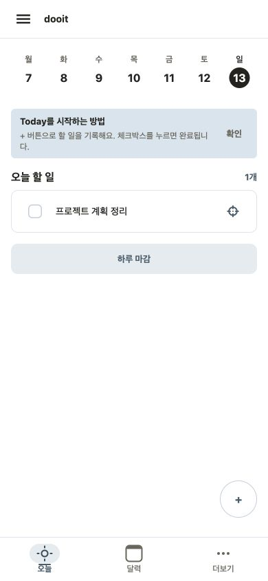
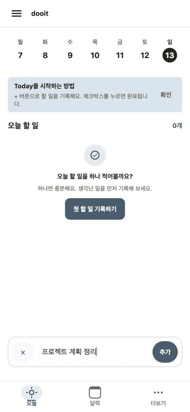
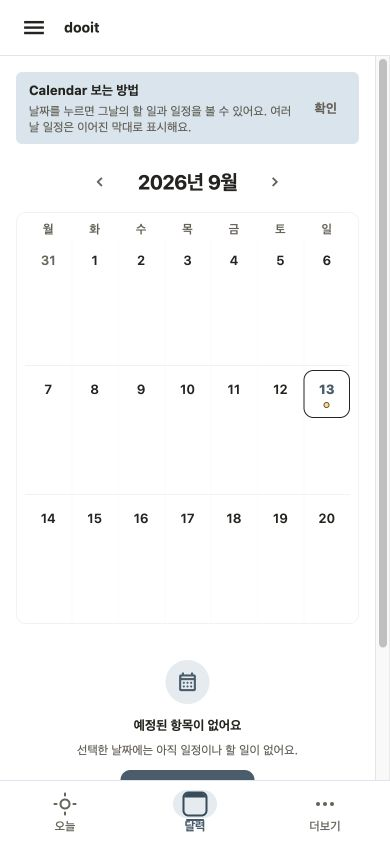
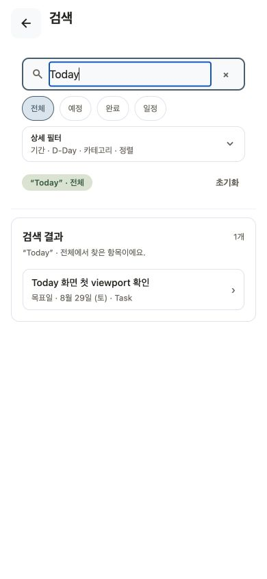
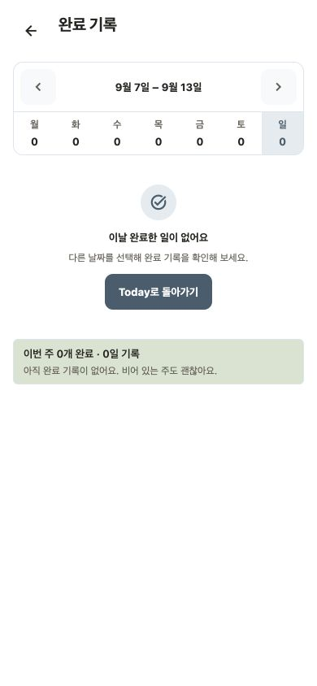
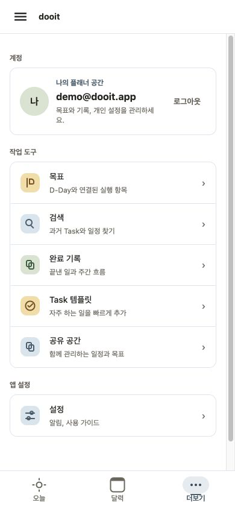
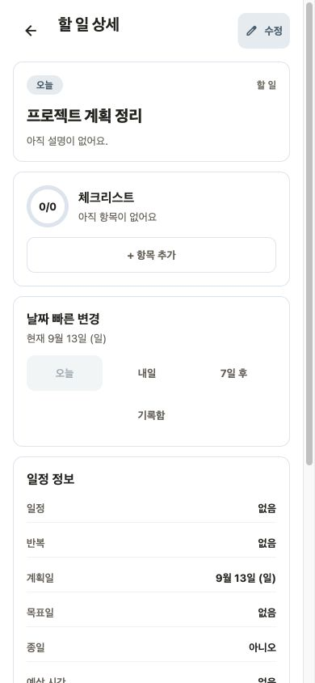
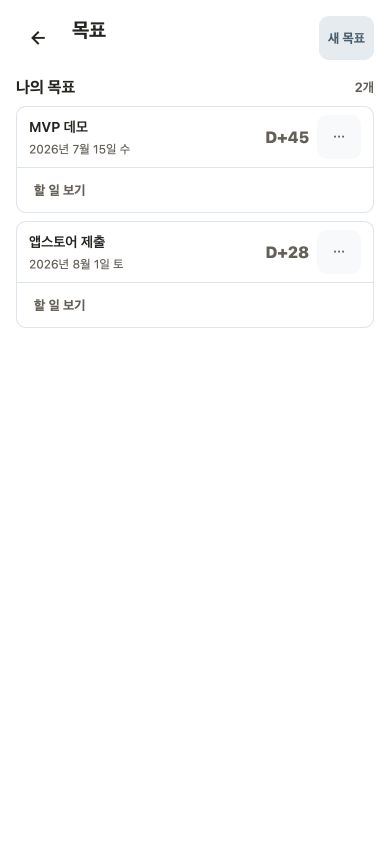
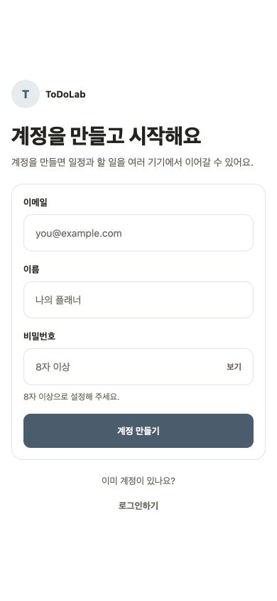
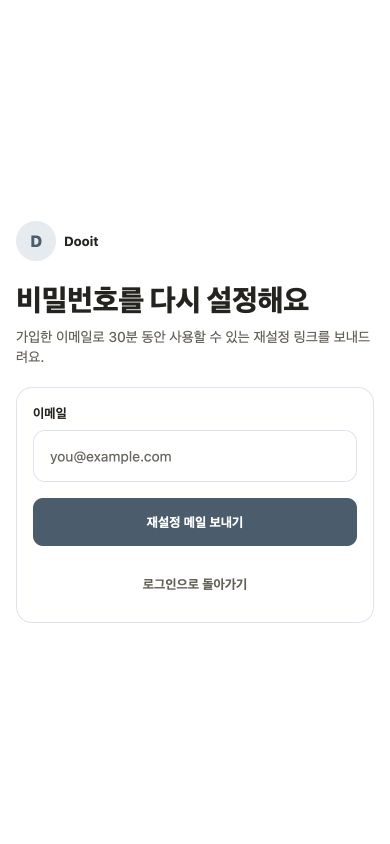

# 화면 가이드

Dooit Mobile의 주요 화면을 실제 캡쳐와 함께 설명하는 문서다. 개발 문서, 백엔드 협업, QA, 데모 준비에서 “이 화면이 어떤 역할을 하고 어떻게 사용하는지”를 빠르게 공유하는 데 사용한다.

스크린샷은 `EXPO_PUBLIC_API_MODE=mock` 기준으로 먼저 촬영하고, 실제 백엔드 연결 검증이 끝나면 필요한 화면만 real 모드 캡쳐를 추가한다.

현재 상태:

- 화면 설명과 캡쳐 기준은 최신 UI 구조 기준으로 정리되어 있다.
- mock Web 390×844 viewport 기준 실제 PNG 캡쳐를 생성했다.
- 현재 대표 캡처 촬영일은 **2026-09-05**, 기준 커밋은 `11a5727`이다. 상세 환경과 화면 상태는 [`screenshots/README.md`](../screenshots/README.md)에서 확인한다.
- 사용자 흐름별 최신 mock Web 캡처와 판정은 [`USER_FLOW_CATALOG.md`](../product/USER_FLOW_CATALOG.md)의 UF-01~UF-08에서 관리한다.
- `docs/screenshots`는 화면 구조 참고용이며 실제 release 판정은 최신 APK와 실기기 QA를 따른다.
- 화면 구조가 바뀌면 아래 파일명을 유지한 채 다시 캡쳐한다.
- 대표 캡처는 촬영 후 7일이 되기 전에 갱신하며 `npm run docs:check`에서 만료 여부를 검사한다.

## 화면 점검 범위

현재 앱 route 기준으로 확인 범위를 아래처럼 관리한다. “문서화”는 화면 가이드 또는 screenshot이 있는 상태, “UF 근거”는 최신 사용자 흐름 캡처에서 확인한 상태를 뜻한다.

| Route             | 화면            | 문서화 | UF 근거              | 남은 확인                                    |
| ----------------- | --------------- | ------ | -------------------- | -------------------------------------------- |
| `/`               | Today           | 완료   | 재점검               | 주간 strip, 빠른 기록 결과, 완료 기본 노출   |
| `/calendar`       | Calendar        | 완료   | 재점검               | 하단 활성 tab, 일정 label overflow           |
| `/profile`        | Profile         | 완료   | 재점검               | 하단 활성 tab, native overlap, screen reader |
| `/today/review`   | 정리할 항목     | 완료   | 완료                 | 상태별 empty/success/error                   |
| `/today/shutdown` | 하루 마감       | 완료   | 완료                 | native 큰 글꼴·dark·API error                |
| `/search`         | Search          | 완료   | 완료                 | real pagination, native keyboard             |
| `/completed`      | Completed       | 완료   | 완료                 | 긴 제목, 다시 열기 affordance native 확인    |
| `/dday`           | D-Day           | 완료   | 완료                 | real API, 긴 목표 제목, screen reader        |
| `/tasks/[taskId]` | Task 상세       | 완료   | 재점검               | header 수정 action, 반복 scope, 긴 상세 내용 |
| `/tasks/new`      | Task 작성       | 완료   | 완료                 | native keyboard, 알림 권한 안내              |
| `/login`          | 로그인          | 완료   | 완료                 | native keyboard, screen reader, brand asset  |
| `/register`       | 계정 만들기     | 완료   | 완료                 | native keyboard, password reset 진입         |
| `/password-reset` | 비밀번호 재설정 | 완료   | mock·API client 구현 | production 메일·deep link real 검증          |
| `/settings`       | 설정            | 완료   | 완료                 | native 알림 권한·기기 설정 복귀              |

남은 공통 확인은 최신 native 화면의 keyboard, font scale, screen reader, 실제 API 오류·빈 상태와 알림 권한 상태다.

## 캡쳐 파일 위치

```text
docs/screenshots/
  today.png
  quick-capture.png
  calendar.png
  search.png
  completed.png
  profile.png
  organize.png
  task-detail.png
  task-new.png
  dday.png
  login.png
  register.png
  password-reset.png
  settings.png
```

## 캡쳐 기준

- 기본 기준: 375pt iPhone 폭 또는 390px mobile viewport
- 보조 기준: 320px, 430dp, 720px Web
- Theme: light 우선, 필요 시 dark 별도 추가
- Data mode: mock 우선
- 상태: 주요 화면은 기본 상태, 필요 시 loading/error/empty 상태를 별도 캡쳐
- 캡쳐 전 `npm run validate`를 통과한 커밋을 기준으로 한다.
- 캡처 후 `manifest.json`의 촬영일, 기준 커밋, 환경과 상태를 함께 갱신한다.

## Today



목적:

- 오늘 처리할 일정과 할 일을 한 화면에서 확인하고 바로 실행한다.
- 일정, 오늘 할 일, 정리할 항목, 완료한 일을 우선순위에 따라 보여준다.

사용 흐름:

1. 앱을 열면 별도 중복 제목 없이 첫 콘텐츠인 주간 날짜 strip에서 오늘 선택 상태를 확인한다.
2. 오늘 일정이 있으면 먼저 확인한다.
3. 오늘 할 일을 체크해 완료한다.
4. 생각난 일은 하단 빠른 기록으로 추가한다.
5. 지난 미완료, 추천, 기록함 항목은 정리할 항목에서 다시 판단한다.

주요 UI:

- 외곽선·세로 구분선 없이 오늘과 월 경계만 강조하는 주간 날짜 strip
- 일정 section
- 오늘 할 일 section
- 정리할 항목 진입 row
- 최근 3개가 기본으로 펼쳐지는 완료 목록
- 빠른 기록 composer

개발 참고:

- Today는 앱의 중심 화면이다.
- 실행 Task 전에 영구적으로 노출되는 큰 정보 카드는 최대 한 개만 허용한다.
- 일정은 Task와 구분되는 Schedule card 문법을 사용한다.

## 빠른 기록



목적:

- 사용자가 생각난 일을 즉시 기록함에 추가한다.

사용 흐름:

1. 하단 빠른 기록 버튼을 누른다.
2. 할 일을 한 줄로 입력한다.
3. 추가 버튼으로 저장한다.
4. 저장 직후 방금 만든 제목과 저장 위치를 확인한다.
5. 날짜 없는 항목은 결과 영역의 `오늘 할 일로 이동` 또는 `내용 확인`을 선택한다.

주요 UI:

- 하단 composer
- 닫기 버튼
- 입력창
- 추가 버튼
- 저장한 제목, 목적지, Today 이동·상세 action이 포함된 성공 feedback

개발 참고:

- 키보드가 열려도 composer와 추가 버튼이 가려지면 안 된다.
- 빠른 기록은 큰 작성 form이 아니라 “나중에 정리할 seed”에 가깝다.

## Calendar



목적:

- 선택 날짜 기준 3주 달력에서 하루 일정과 여러 날에 걸친 일정을 확인한다.
- 특정 날짜를 선택해 예정·완료 항목을 확인한다.

사용 흐름:

1. 3주 planner grid에서 앞뒤 일정을 훑는다.
2. 하루 일정 label과 여러 날 일정 bar를 확인한다.
3. 날짜를 선택해 하단 목록을 확인한다.
4. 일정 또는 Task를 눌러 상세로 이동한다.

주요 UI:

- 주 단위 이동 controls
- 월 선택 panel
- 3주 calendar grid
- 하루 일정 label
- 여러 날 일정 bar
- `+N` overflow
- 선택 날짜의 예정·완료 목록

개발 참고:

- 여러 날 일정은 날짜마다 복제하지 않고 하나의 원본 ID로 표시한다.
- Calendar의 일정 bar는 날짜 cell 경계를 넘지 않아야 한다.
- Calendar 범위 조회는 백엔드 v1 계약과 `Asia/Seoul` 시간대 기준을 따른다. 여러 날 일정 bar와 Today 목록이 같은 원본 Task를 가리키는지 real mode에서 확인한다.

## Search



목적:

- 과거 Task, 일정, 완료 기록을 키워드와 필터로 찾는다.

사용 흐름:

1. 검색어를 입력한다.
2. 상태, 기간, D-Day, category, 정렬 조건을 조정한다.
3. 결과 row를 눌러 Task 상세로 이동한다.
4. 결과가 많으면 다음 페이지를 불러온다.

주요 UI:

- 검색 input
- 상태 filter
- 날짜 범위 filter
- D-Day filter
- category filter
- 정렬 filter
- 검색 결과 row

개발 참고:

- mock 검색과 real `/api/v1/tasks/search` 계약이 모두 준비되어 있다. real mode에서는 검색어, filter, 빈 상태, cursor pagination을 smoke test한다.
- 검색 결과에는 관련 날짜와 date source가 함께 보여야 한다.

## Completed



목적:

- 완료한 일을 날짜별로 확인하고 필요하면 다시 오늘 할 일로 되돌린다.

사용 흐름:

1. 주 단위 날짜 picker에서 날짜를 선택한다.
2. 선택 날짜의 완료 목록을 확인한다.
3. 필요한 완료 Task를 다시 연다.

주요 UI:

- 주 이동 controls
- 날짜별 완료 count
- 선택 날짜 완료 목록
- 다시 열기 action

개발 참고:

- 완료 목록은 성취 확인이 목적이므로 과도한 통계보다 실제 완료 card를 우선한다.

## 더보기



목적:

- 검색, 완료 기록, D-Day, 설정 등 보조 목적지로 이동한다.

사용 흐름:

1. 프로필 화면에서 원하는 목적지를 선택한다.
2. 검색, 완료 기록, 목표, 설정으로 이동한다.

주요 UI:

- 목적지 row list
- 목적별 accent icon
- title, description, chevron

개발 참고:

- 더보기는 설정과 보조 기능의 hub다. route와 기존 파일명은 호환성을 위해 `/profile`, `profile.png`를 유지한다.
- 카드 grid가 아니라 세로 navigation row 문법을 유지한다.

## Task 상세



목적:

- Task의 상세 정보, 날짜, 반복 여부, D-Day 연결 상태를 확인하고 수정한다.

사용 흐름:

1. 목록에서 Task를 선택한다.
2. 제목, 설명, 일정, 계획일, 목표일, 반복 여부를 확인한다.
3. 필요하면 수정하거나 삭제한다.
4. 날짜 빠른 변경으로 오늘·내일·7일 후·기록함으로 이동한다.

주요 UI:

- 상태 badge
- 제목/설명
- 날짜 빠른 변경
- 정보 section
- D-Day 연결 section
- 수정/삭제 action

개발 참고:

- 반복 정보와 작성/수정 UI는 real smoke가 통과한 계약 안에서 제공한다. 생성, occurrence 조회, 완료, 미룸, 건너뛰기 회귀는 `npm run smoke:recurrence:real`과 `npm run smoke:recurrence-actions:real`로 확인한다.

## D-Day



목적:

- 목표 날짜가 있는 항목을 관리하고 Today Task로 연결한다.

사용 흐름:

1. D-Day 목표를 생성한다.
2. 목표까지 남은 날짜를 확인한다.
3. 목표와 연결된 오늘 할 일을 추가한다.

주요 UI:

- 목표 생성 form
- 목표 card
- D-Day label
- 연결 Task 목록
- Today 할 일 만들기 action

개발 참고:

- D-Day v1 endpoint를 사용한다. legacy `/api/ddays/**` alias는 모바일 신규 계약에 추가하지 않는다.

## Auth






목적:

- 사용자가 계정을 만들고 로그인해 실제 데이터 동기화를 시작한다.
- 비밀번호를 잊은 사용자가 막다른 길에 갇히지 않도록 재설정 진입점과 안내 화면을 제공한다.

사용 흐름:

1. 로그인 화면에서 이메일과 비밀번호를 입력한다.
2. 계정이 없으면 계정 만들기 화면에서 이메일, 이름, 비밀번호를 입력한다.
3. 비밀번호를 잊은 경우 로그인 화면의 재설정 링크를 누른다.
4. 이메일 요청 뒤 메일 발송 안내를 확인한다.
5. deep link token 검증, 새 비밀번호 저장, 로그인 완료 안내 순서로 복구한다.

주요 UI:

- 브랜드 mark와 짧은 설명
- 이메일/비밀번호 form card
- password 보기 action
- 계정 만들기/로그인하기 보조 action
- 비밀번호 재설정 안내 card

개발 참고:

- 첫 설치 상태에서 access token 없이 받은 401은 세션 만료 안내로 보여주지 않는다.
- 비밀번호 재설정 API 계약은 [`API_PASSWORD_RESET.md`](../api/API_PASSWORD_RESET.md)를 따른다. 이메일 요청, token 검증, 새 비밀번호 저장과 로그인 완료 안내를 제공한다.
- 현재 `assets/images/icon.png`는 Expo 기본 icon이므로 최종 brand asset 확정 후 인증 화면의 임시 `T` mark를 함께 교체한다.

## 캡쳐 후 업데이트 체크리스트

- [x] 모든 이미지 파일명이 이 문서의 경로와 일치한다.
- [x] 스크린샷이 mock 데이터 기준인지 real 데이터 기준인지 명시한다.
- [x] 촬영일, 기준 커밋, viewport가 `manifest.json`에 기록되어 있다.
- [x] 개인정보, 실제 일정, 실제 검색어가 이미지에 포함되지 않는다.
- [x] README의 문서 링크가 최신 상태다.
- [x] 마켓용 이미지는 [`APP_STORE_ASSETS.md`](../marketing/APP_STORE_ASSETS.md)에 별도로 정리한다.
