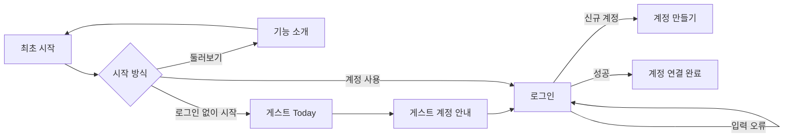
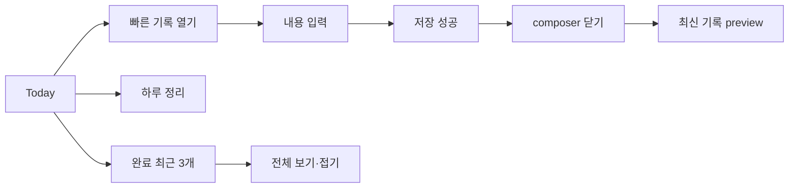
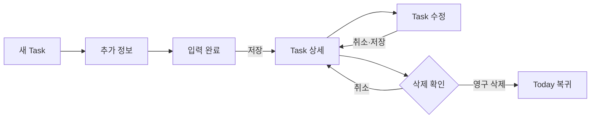

# ToDoLab 사용자 흐름 보드

Last updated: 2026-08-24

이 문서는 구현과 함께 갱신하는 사용자 흐름의 시각적 원본이다. 전체 시나리오와 미검증 상태는 [`USER_FLOW_CATALOG.md`](./USER_FLOW_CATALOG.md), 화면별 판정과 재현 조건은 각 audit README에서 확인한다.

## 진행 현황

| Flow  | 범위                         | 최신 캡처 | 판정      | 상세 근거                                                                       |
| ----- | ---------------------------- | --------- | --------- | ------------------------------------------------------------------------------- |
| UF-01 | 최초 시작·계정 연결          | 10장      | 보강 필요 | [2026-08-23 audit](../audits/uf-01-first-use-2026-08-23/README.md)              |
| UF-02 | Today 실행·빠른 기록         | 9장       | 보강 필요 | [2026-08-23 audit](../audits/uf-02-today-quick-capture-2026-08-23/README.md)    |
| UF-03 | Task 생성·조회·수정·삭제     | 7장       | 보강 필요 | [2026-08-24 audit](../audits/uf-03-task-crud-2026-08-24/README.md)              |
| UF-04 | 반복 Task occurrence         | 준비 중   | 누락 큼   | [Workspace 반복 범위 참고](../audits/workspace-recurrence-2026-08-18/README.md) |
| UF-05 | Calendar·검색·완료 기록 탐색 | 준비 중   | 보강 필요 | [기존 전체 UI audit](../audits/product-design-2026-08-12/README.md)             |
| UF-06 | D-Day 목표                   | 준비 중   | 보강 필요 | [기존 전체 UI audit](../audits/product-design-2026-08-12/README.md)             |
| UF-07 | Workspace                    | 분산됨    | 누락 큼   | [Workspace UI 흐름](./WORKSPACE_UI_FLOW.md)                                     |
| UF-08 | 설정·알림·세션 복구          | 준비 중   | 누락 큼   | [사용자 흐름 카탈로그](./USER_FLOW_CATALOG.md#uf-08-설정알림세션-복구)          |

## UF-01. 최초 시작과 계정 연결

| 01 최초 시작                                                                          | 02 기능 둘러보기                                                           | 03 로그인                                                                      | 04 입력 오류                                                                      | 05 계정 만들기                                                                      |
| ------------------------------------------------------------------------------------- | -------------------------------------------------------------------------- | ------------------------------------------------------------------------------ | --------------------------------------------------------------------------------- | ----------------------------------------------------------------------------------- |
|                        |  |                    |  |                 |
| 06 비밀번호 재설정 직접 경로                                                          | 07 게스트 Today                                                            | 08 게스트 계정 안내                                                            | 09 계정 연결 로그인                                                               | 10 연결 완료                                                                        |
|  |    |  |          |  |

## UF-02. Today 실행과 빠른 기록

| 01 최초 안내                                                                                    | 02 Today 기본                                                                                 | 03 빠른 기록 열기                                                                                  | 04 입력                                                                                           | 05 저장 성공                                                                                        |
| ----------------------------------------------------------------------------------------------- | --------------------------------------------------------------------------------------------- | -------------------------------------------------------------------------------------------------- | ------------------------------------------------------------------------------------------------- | --------------------------------------------------------------------------------------------------- |
|        |             |         |      |  |
| 06 닫은 뒤                                                                                      | 07 하루 정리 여러 항목                                                                        | 08 완료 기본                                                                                       | 09 완료 펼침                                                                                      |                                                                                                     |
|  |  |  |  |                                                                                                     |

## UF-03. Task 생성·조회·수정·삭제

| 01 새 Task 기본                                                               | 02 추가 정보                                                                        | 03 입력 완료                                                                            | 04 Task 상세                                                                         |
| ----------------------------------------------------------------------------- | ----------------------------------------------------------------------------------- | --------------------------------------------------------------------------------------- | ------------------------------------------------------------------------------------ |
|  |  |           |  |
| 05 Task 수정                                                                  | 06 삭제 확인                                                                        | 07 삭제 후 Today                                                                        |                                                                                      |
|            |        |  |                                                                                      |

## 갱신 규칙

1. 각 UF의 정상 흐름을 mock Web 390×844에서 먼저 캡처한다.
2. 입력 오류·시스템 오류·권한 제한·복구 상태를 같은 audit 폴더에 추가한다.
3. audit README에 재현 조건과 판정을 기록하고 이 보드의 해당 행과 화면 표를 갱신한다.
4. 화면 구조가 바뀌면 기존 파일명을 유지해 교체하지 않고 검증 날짜가 포함된 새 audit 묶음을 만든다.
5. Android·iOS 전용 권한, 키보드, safe area와 접근성 상태는 플랫폼을 명시해 분리한다.
