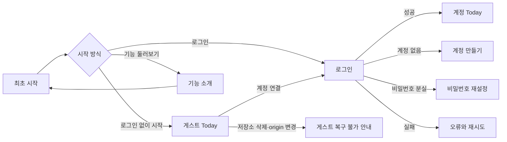
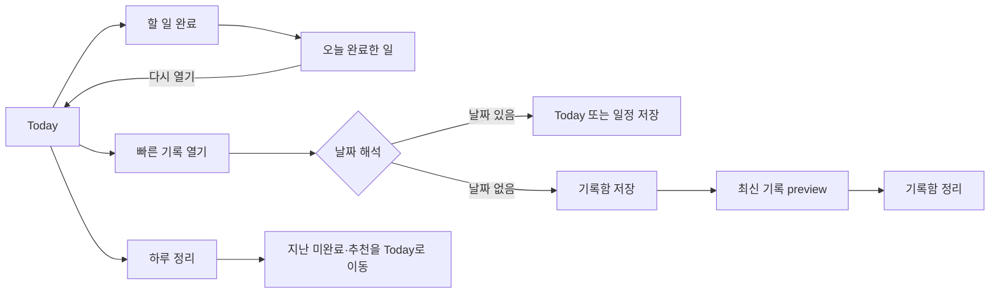
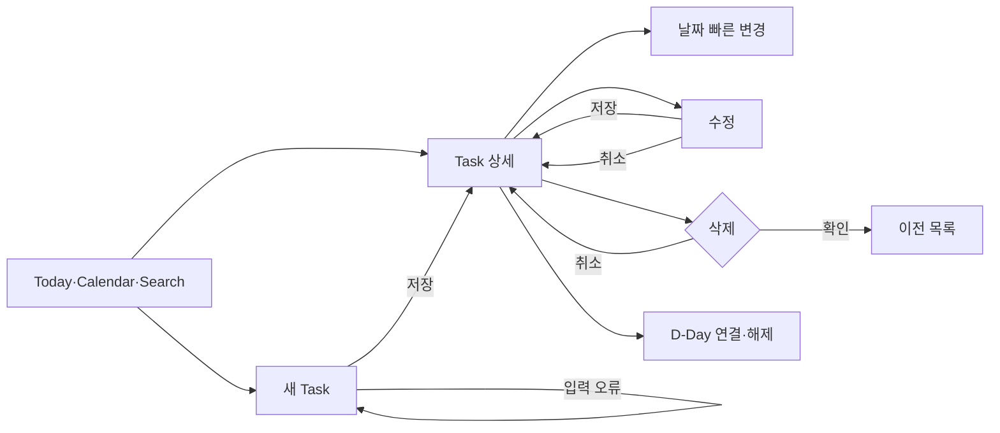
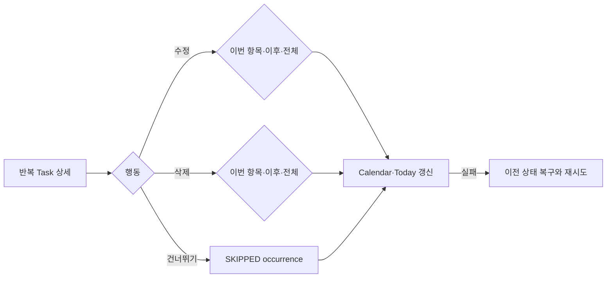
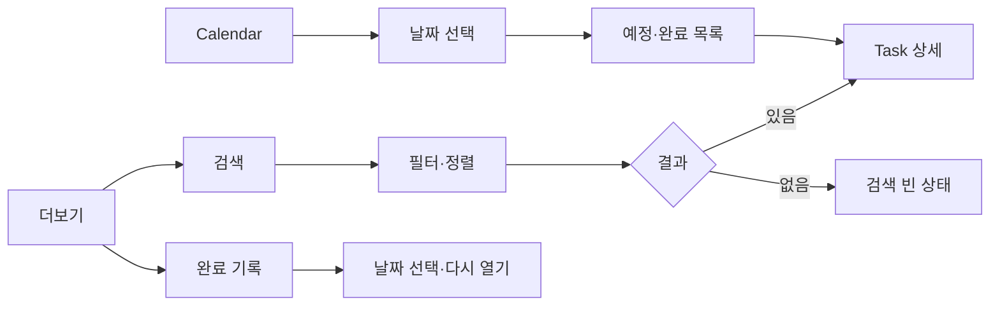
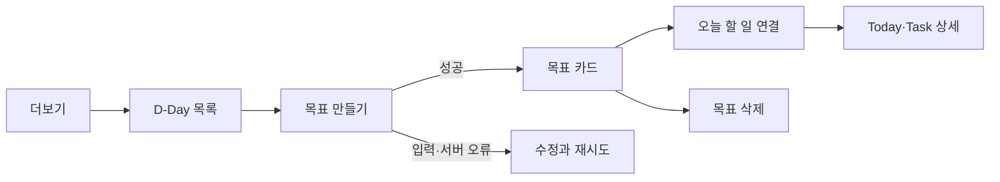
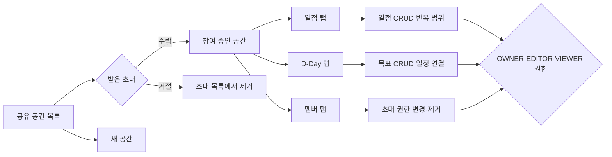
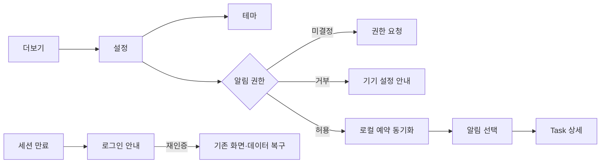

# ToDoLab 사용자 흐름 카탈로그

Last updated: 2026-08-23

이 문서는 프론트엔드의 사용자 시나리오를 **진입 → 행동 → 결과 → 예외/복구** 순서로 연결하는 원본이다. 화면 단위 설명은 [`SCREEN_GUIDE.md`](../design/SCREEN_GUIDE.md), 실제 검증 절차는 [`SMOKE_TEST_CHECKLIST.md`](../qa/SMOKE_TEST_CHECKLIST.md), 세부 시각 판단은 [`audits`](../audits/product-design-2026-08-12/README.md)를 따른다.

Figma·FigJam은 공유와 토론용 사본으로 사용하고, 구현과 함께 갱신해야 하는 route·상태·검증 여부는 이 문서를 기준으로 한다.

## 관리 단위

각 단계는 다음 상태를 필요에 따라 분리해 캡처한다.

| 상태        | 확인 내용                                                 |
| ----------- | --------------------------------------------------------- |
| 기본        | 사용자가 처음 보는 정상 화면과 주요 행동                  |
| 진행        | loading, submitting, disabled, optimistic update          |
| 완료        | 저장·이동·완료·수락 뒤 결과와 다음 행동                   |
| 빈 상태     | 데이터가 없을 때 설명과 시작 CTA                          |
| 입력 오류   | 필수값, 형식, 중복 입력과 focus 이동                      |
| 시스템 오류 | network, timeout, 4xx, 5xx와 retry                        |
| 권한 제한   | 게스트, OWNER·EDITOR·VIEWER, 알림 거부                    |
| 복구        | 새로고침, 앱 재실행, session 만료, mutation 실패 rollback |

## UF-01. 최초 시작과 계정 연결

현재 근거:

- [최초 사용 흐름 390px](../audits/first-use-2026-08-11/README.md)
- [로그인](../screenshots/login.png), [계정 만들기](../screenshots/register.png), [비밀번호 재설정](../screenshots/password-reset.png)

남은 캡처:

- 로그인 loading·입력 오류·network/timeout·401 만료
- 게스트 생성 실패·재시도와 계정 연결 병합 성공/실패
- 앱 재실행과 브라우저 새로고침 뒤 session 복원

## UF-02. Today 실행과 빠른 기록

현재 근거:

- [Today](../screenshots/today.png), [빠른 기록 성공](../screenshots/quick-capture.png), [정리할 항목](../screenshots/organize.png)
- 최신 기록 preview와 하루 정리 분리는 [`QUICK_CAPTURE_INBOX_UX_PROPOSAL.md`](./QUICK_CAPTURE_INBOX_UX_PROPOSAL.md)의 구현 전 상태다.

남은 캡처:

- 빠른 기록 입력·저장 중·성공·실패·Escape 닫기
- composer를 닫은 뒤 최신 기록 preview
- 기록함 0개·1개·여러 개와 하루 정리 0개·여러 개
- 완료 0개·1~3개·4개 이상 펼침/접힘

## UF-03. Task 생성·조회·수정·삭제

현재 근거:

- [Task 작성](../screenshots/task-new.png), [Task 상세](../screenshots/task-detail.png)
- [Task 상세 수정 행동 재점검](../audits/task-detail-edit-2026-08-23/README.md)

남은 캡처:

- 작성 기본/추가 정보 펼침/validation/저장 중/오류
- 상세 수정 진입/저장/취소와 삭제 확인/오류
- 긴 제목·설명, 일정·종일·날짜 없음, D-Day 연결 전후

## UF-04. 반복 Task occurrence

현재 근거:

- 개인 반복 흐름은 API 문서와 real smoke 기록만 있고 단계별 최신 화면 묶음은 없다.
- Workspace 반복 범위는 [수정·삭제 캡처](../audits/workspace-recurrence-2026-08-18/README.md)가 있다.

남은 캡처:

- 개인 Task의 이번 occurrence·이후·전체 수정/삭제
- 건너뛰기와 Today·Calendar 반영
- mutation 실패 rollback

## UF-05. Calendar·검색·완료 기록 탐색

현재 근거:

- [Calendar](../screenshots/calendar.png), [검색](../screenshots/search.png), [완료 기록](../screenshots/completed.png)

남은 캡처:

- Calendar 일정 없음·여러 날 일정·`+N` overflow·월 선택
- 검색 전·결과 있음·결과 없음·다음 페이지·오류·상세 왕복 복원
- 완료 없음·여러 개·다시 열기 성공/실패

## UF-06. D-Day 목표

현재 근거:

- [D-Day 목록](../screenshots/dday.png), [D-Day 생성 audit](../audits/product-design-2026-08-12/09b-dday-create.png)

남은 캡처:

- 목표 없음·생성 form·validation·생성 성공/실패
- 목표별 연결 Task 0개·여러 개
- Today Task 생성과 기존 Task 연결·해제·삭제

## UF-07. Workspace 초대·일정·목표·멤버

현재 근거:

- 기준 흐름은 [`WORKSPACE_UI_FLOW.md`](./WORKSPACE_UI_FLOW.md)에 있다.
- [초대 수락](../audits/workspace-invitation-2026-08-18/README.md), [탭 이동](../audits/workspace-navigation-2026-08-18/README.md), [반응형·키보드](../audits/workspace-responsive-2026-08-19/README.md), [접근 오류](../audits/workspace-access-error-2026-08-19/README.md)

남은 캡처:

- 공간 생성·수정·삭제 성공/실패
- OWNER·EDITOR·VIEWER별 일정·D-Day·멤버 행동 차이
- 초대 거절 계약 구현 뒤 확인/성공/404·409
- Task가 있는 Workspace 삭제 500 수정 뒤 real 검증

## UF-08. 설정·알림·세션 복구

현재 근거:

- [설정](../screenshots/settings.png)
- 알림과 세션은 계약·QA 체크리스트만 있고 실제 상태별 캡처 묶음은 없다.

남은 캡처:

- light·dark 전환
- 알림 미결정·허용·거부·설정 복귀·동기화 오류
- foreground·background·cold start 알림 선택
- session 만료·재로그인·계정 전환과 기존 route 복구

## 화면·상태 커버리지

| 영역               | 기본 화면 | 성공 | 빈 상태   | 입력 오류 | 시스템 오류    | 권한/역할        | 복구 | 판정      |
| ------------------ | --------- | ---- | --------- | --------- | -------------- | ---------------- | ---- | --------- |
| 최초 시작·인증     | 있음      | 일부 | 해당 없음 | 부족      | 부족           | 게스트 일부      | 부족 | 보강 필요 |
| Today·빠른 기록    | 있음      | 있음 | 일부      | 부족      | 부족           | 해당 없음        | 부족 | 보강 필요 |
| Task CRUD          | 있음      | 일부 | 해당 없음 | 부족      | 부족           | 해당 없음        | 부족 | 보강 필요 |
| 반복 occurrence    | 일부      | 일부 | 해당 없음 | 해당 없음 | 없음           | 범위 선택 일부   | 없음 | 누락 큼   |
| Calendar·검색·완료 | 있음      | 일부 | 일부      | 일부      | 부족           | 해당 없음        | 부족 | 보강 필요 |
| D-Day              | 있음      | 일부 | 있음      | 부족      | 부족           | 해당 없음        | 부족 | 보강 필요 |
| Workspace          | 분산됨    | 일부 | 일부      | 부족      | 접근 오류 일부 | 역할 문서만      | 부족 | 누락 큼   |
| 설정·알림·세션     | 설정만    | 부족 | 해당 없음 | 해당 없음 | 부족           | 알림 권한 문서만 | 부족 | 누락 큼   |

## 캡처와 보드 갱신 순서

1. mock Web 390×844에서 각 흐름의 기본·완료·빈 상태를 다시 캡처한다.
2. 320px와 430px는 줄바꿈이나 행동 위계가 달라지는 단계만 추가한다.
3. network·timeout·4xx·5xx와 mutation rollback은 재현 조건을 캡처명과 함께 기록한다.
4. Android·iOS 전용 권한, 키보드, safe area, VoiceOver·TalkBack은 실제 기기 캡처로 분리한다.
5. 승인된 최신 캡처만 FigJam의 흐름별 section에 좌→우로 배치한다.
6. FigJam card에는 flow ID, 단계, 상태, route, 검증 날짜와 연결 문서만 둔다.

## 완료 기준

- 각 flow가 정상 경로와 최소 한 개의 실패·복구 경로를 가진다.
- diagram의 모든 화면 단계가 최신 캡처 또는 명시적인 `캡처 불가/미구현` 상태와 연결된다.
- 화면 구조 변경 시 같은 flow ID와 캡처명을 갱신한다.
- FigJam과 이 문서가 충돌하면 Git 이력과 가까운 이 문서를 먼저 갱신하고 FigJam을 동기화한다.
